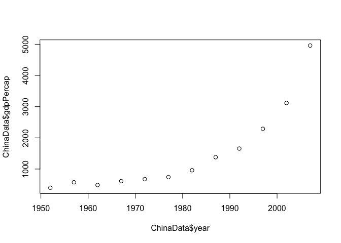
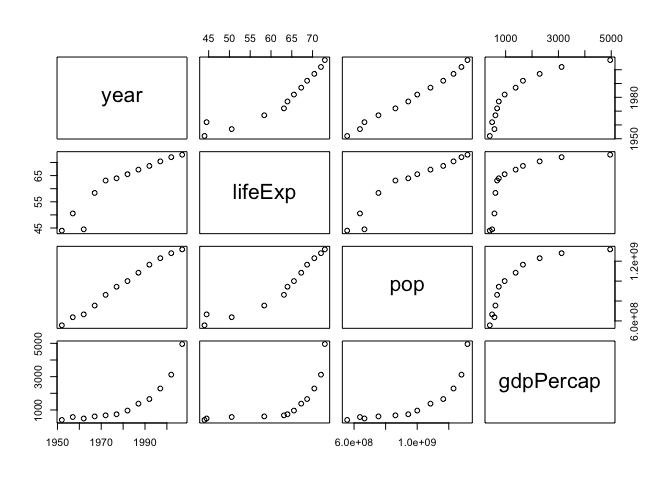

hw01\_gapminder
================
Liming Liu
2018-09-13

## Gapminder exploration

Load the `gapminder` R package

``` r
library(gapminder)
```

Get a quick view of the data

``` r
head(gapminder)
```

    ## # A tibble: 6 x 6
    ##   country     continent  year lifeExp      pop gdpPercap
    ##   <fct>       <fct>     <int>   <dbl>    <int>     <dbl>
    ## 1 Afghanistan Asia       1952    28.8  8425333      779.
    ## 2 Afghanistan Asia       1957    30.3  9240934      821.
    ## 3 Afghanistan Asia       1962    32.0 10267083      853.
    ## 4 Afghanistan Asia       1967    34.0 11537966      836.
    ## 5 Afghanistan Asia       1972    36.1 13079460      740.
    ## 6 Afghanistan Asia       1977    38.4 14880372      786.

Get a summary of the dataset

``` r
summary(gapminder)
```

    ##         country        continent        year         lifeExp     
    ##  Afghanistan:  12   Africa  :624   Min.   :1952   Min.   :23.60  
    ##  Albania    :  12   Americas:300   1st Qu.:1966   1st Qu.:48.20  
    ##  Algeria    :  12   Asia    :396   Median :1980   Median :60.71  
    ##  Angola     :  12   Europe  :360   Mean   :1980   Mean   :59.47  
    ##  Argentina  :  12   Oceania : 24   3rd Qu.:1993   3rd Qu.:70.85  
    ##  Australia  :  12                  Max.   :2007   Max.   :82.60  
    ##  (Other)    :1632                                                
    ##       pop              gdpPercap       
    ##  Min.   :6.001e+04   Min.   :   241.2  
    ##  1st Qu.:2.794e+06   1st Qu.:  1202.1  
    ##  Median :7.024e+06   Median :  3531.8  
    ##  Mean   :2.960e+07   Mean   :  7215.3  
    ##  3rd Qu.:1.959e+07   3rd Qu.:  9325.5  
    ##  Max.   :1.319e+09   Max.   :113523.1  
    ## 

## Explore the column of Asia

Extract the data of Asia and get a summary

``` r
AsiaData <- gapminder[gapminder$continent=="Asia",]
summary(AsiaData)
```

    ##              country       continent        year         lifeExp     
    ##  Afghanistan     : 12   Africa  :  0   Min.   :1952   Min.   :28.80  
    ##  Bahrain         : 12   Americas:  0   1st Qu.:1966   1st Qu.:51.43  
    ##  Bangladesh      : 12   Asia    :396   Median :1980   Median :61.79  
    ##  Cambodia        : 12   Europe  :  0   Mean   :1980   Mean   :60.06  
    ##  China           : 12   Oceania :  0   3rd Qu.:1993   3rd Qu.:69.51  
    ##  Hong Kong, China: 12                  Max.   :2007   Max.   :82.60  
    ##  (Other)         :324                                                
    ##       pop              gdpPercap     
    ##  Min.   :1.204e+05   Min.   :   331  
    ##  1st Qu.:3.844e+06   1st Qu.:  1057  
    ##  Median :1.453e+07   Median :  2647  
    ##  Mean   :7.704e+07   Mean   :  7902  
    ##  3rd Qu.:4.630e+07   3rd Qu.:  8549  
    ##  Max.   :1.319e+09   Max.   :113523  
    ## 

Extract the data of 2007 and get a ranking according to gdpPercap in
2007

``` r
Asia2007 <- AsiaData[AsiaData$year==2007,]
Asia2007[rank(Asia2007$gdpPercap),]
```

    ## # A tibble: 33 x 6
    ##    country          continent  year lifeExp      pop gdpPercap
    ##    <fct>            <fct>     <int>   <dbl>    <int>     <dbl>
    ##  1 Bahrain          Asia       2007    75.6   708573    29796.
    ##  2 Taiwan           Asia       2007    78.4 23174294    28718.
    ##  3 Cambodia         Asia       2007    59.7 14131858     1714.
    ##  4 Hong Kong, China Asia       2007    82.2  6980412    39725.
    ##  5 Mongolia         Asia       2007    66.8  2874127     3096.
    ##  6 Vietnam          Asia       2007    74.2 85262356     2442.
    ##  7 Iran             Asia       2007    71.0 69453570    11606.
    ##  8 Korea, Dem. Rep. Asia       2007    67.3 23301725     1593.
    ##  9 Oman             Asia       2007    75.6  3204897    22316.
    ## 10 Lebanon          Asia       2007    72.0  3921278    10461.
    ## # ... with 23 more rows

## Explore the data of a specific country

Extract the data of China and plot the trend of gdpPercap through 1952 -
2007

``` r
ChinaData <- AsiaData[AsiaData$country=="China",]
plot(ChinaData$year,ChinaData$gdpPercap,lty=1)
```

<!-- -->

Delete column Continent and Country. Look at the trends between year,
lifeExp, pop, gdpPerCap columns

``` r
ChinaData2 <- ChinaData[,-1]
ChinaData2 <- ChinaData2[,-1]
pairs(ChinaData2)
```

<!-- -->
